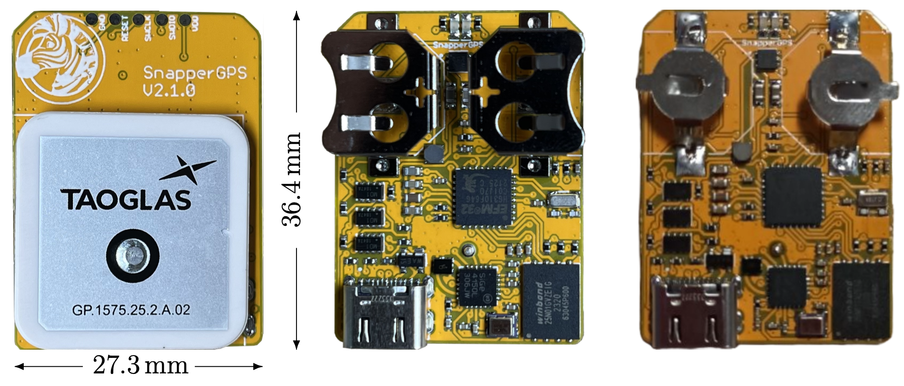

# snappergps-pcb-2-1

This is an alternative version of [the original SnapperGPS receiver V1.0.0](https://github.com/SnapperGPS/snappergps-pcb).
Just like V1.0.0, V2.0.0, and V2.2.0, it is a small, low-cost, and low-power GNSS receiver intended for non-real-time wildlife tracking.
It employs the snapshot GNSS technology, which offloads the computational expensive data processing to the cloud, and:

* Measures 27.3 mm x 36.4 mm,

* Operates for more than a year on two button batteries,

* Weighs 9.5 g or 13.0 g (depending on the type of batteries),

* Has enough memory to provide about 22,000 position fixes,

* Captures fixes in user-defined time intervals or externally triggered,

* Needs only 12 ms of signal reception for a fix,

* Employs multiple satellite systems for high reliability (GPS, Galileo, and BeiDou),

* Achieves a median real-world tracking accuracy of about 12 m (before smoothing),

* Maintains a real-time clock to accurately timestamp the fixes,

* Measures the temperature in addition, and

* Is configured via USB in your browser without the need to install a driver or an app.

This repository contains the hardware design files that can be used to replicate a SnapperGPS receiver V2.1.0.

If you use SnapperGPS hardware or software for research, please consider citing our publications.

For the hardware:

> Jonas Beuchert, Amanda Matthes, and Alex Rogers. 2023. SnapperGPS: Open Hardware for Energy-Efficient, Low-Cost Wildlife Location Tracking with Snapshot GNSS. Journal of Open Hardware, 7(1): 2, pp. 1–13. [https://doi.org/10.5334/joh.48](https://openhardware.metajnl.com/articles/10.5334/joh.48/).

For the cloud-processing software:

> Jonas Beuchert and Alex Rogers. 2021. SnapperGPS: Algorithms for Energy-Efficient Low-Cost Location Estimation Using GNSS Signal Snapshots. In SenSys ’21: ACM Conference on Embedded Networked Sensor Systems, November, 2021, Coimbra, Portugal. ACM, New York, NY, USA, 13 pages. https://doi.org/10.1145/3485730.3485931.

|  | 
|:--:| 
| *Figure 1: Top view (left) and bottom views (centre, right) of assembled SnapperGPS receivers V2.1.0 with a passive ceramic patch antenna and holders for two LR44 or SR44 button cells (centre) or two LR41 or SR41 button cells (right). This version is similar to V2.0.0, but does not come with GPIOs or a connector for an external antenna.* |
